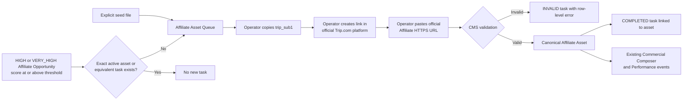

# Trip.com Affiliate Asset Setup Queue

The queue turns a small set of explicit seeds and high-value Affiliate Opportunities into durable, operator-completable Trip.com link-building tasks. It does not log in to Trip.com, store credentials or sessions, scrape the affiliate dashboard, or execute provider HTML/scripts.

## Workflow



Commercial composition still runs only after QA. Queue records and completed assets are never read by Research extraction, Claims, Knowledge, topic ranking, briefs, draft generation, or editorial QA.

## Task identity and sources

`task_key` is a unique semantic key such as `trip:hotel:destination:beijing`, `trip:train:route:beijing-xian`, or `trip:attraction:entity:forbidden-city`. `trip_sub1` is generated once from reusable commercial scope, uses only lowercase `a-z`, `0-9`, and `_`, and never contains database or article IDs. If two different task keys yield the same base value, the second receives a deterministic task-key hash suffix. Existing tasks never change their `trip_sub1`.

Tasks may be created only by:

1. The operator-maintained [`config/affiliate-queue-seeds.json`](../config/affiliate-queue-seeds.json) file.
2. A persisted Affiliate Opportunity whose intent is `HIGH` or `VERY_HIGH`, score meets `AFFILIATE_OPPORTUNITY_THRESHOLD`, and exact active Asset/equivalent task is absent.

There is no city, hotel, attraction, route, airport, or country Cartesian expansion. A broad fallback does not suppress a reusable, high-value exact Entity/Route/Area task.

## Operator guidance

| Product/scope | Trip.com tool guidance | Queue result |
|---|---|---|
| Hotel destination | Hotels page → Destination | `CATEGORY_LINK` |
| Specific hotel | Hotels page → Property | `DEEP_LINK` |
| Flight route | Flights page → Departure + Arrival | `DEEP_LINK` |
| Train route | Trains page → Departure + Arrival | `DEEP_LINK` |
| Attraction, ticket, tour, specific page | Custom Link | Scope-specific `DEEP_LINK` or explicit category link |
| Search Box | Structured Search Box config | `SEARCH_BOX`; no HTML/script |
| Promotion | Explicit task with start and end dates | `PROMOTION`; both dates required |

Banner tasks are not generated as a default fallback.

## URL and embed safety

Completion accepts the exact operator-pasted public URL and does not add, remove, reorder, or invent tracking parameters. The current Trip.com allowlist accepts credential-free HTTPS hosts on `trip.com`, `tripcdn.com`, and `ctrip.com`, including their subdomains. `javascript:`, `data:`, credential-bearing URLs, raw HTML, script, and off-provider domains are rejected.

Search Box completion may use either an official Affiliate URL or a structured `embedConfig`. It reuses `normalizeEmbedConfig`; official embed source hosts use the same allowlist. The CMS does not guess the provider's current widget schema.

## API

All mutations require dashboard/admin authorization.

| Method | Path | Purpose |
|---|---|---|
| `GET` | `/api/commercial/affiliate-queue` | List and filter by `status`, `product_category`, `scope_type`, or `provider` |
| `POST` | `/api/commercial/affiliate-queue/seed` | Idempotently load the explicit seed file |
| `POST` | `/api/commercial/affiliate-queue/:id/complete` | Validate URL/config, create one Asset, and complete the task |
| `POST` | `/api/commercial/affiliate-queue/:id/skip` | Idempotently skip an incomplete task |
| `POST` | `/api/commercial/affiliate-queue/export` | Export filtered queue rows as CSV or JSON |
| `POST` | `/api/commercial/affiliate-queue/import` | Dry-run or apply CSV/JSON completion rows |

Example completion:

```json
{
  "affiliateUrl": "https://www.trip.com/t/official-affiliate-link?sub1=stc_hotel_beijing"
}
```

Import identifies each row by both `task_id` and `task_key`. Blank URL rows remain unchanged. Duplicate identities, mismatches, invalid URLs, and completed-task protection are returned per row, so one bad row does not roll back valid rows. Run with `dryRun: true` before applying the same file with `dryRun: false`.

## Current provider-dependent limits

- The exact production redirect domains issued to this account must be checked against the allowlist before first use. Add only documented official Trip.com-owned domains.
- Search Box field names beyond the existing generic structured contract remain pending an official Trip.com schema/sample.
- Official API/feed synchronization, dashboard automation, booking/commission report import, automatic provider-side Sub ID insertion, and promotion-aware learned ranking are not implemented.
- Static/Dynamic Banner setup is intentionally not generated as an automatic fallback.
